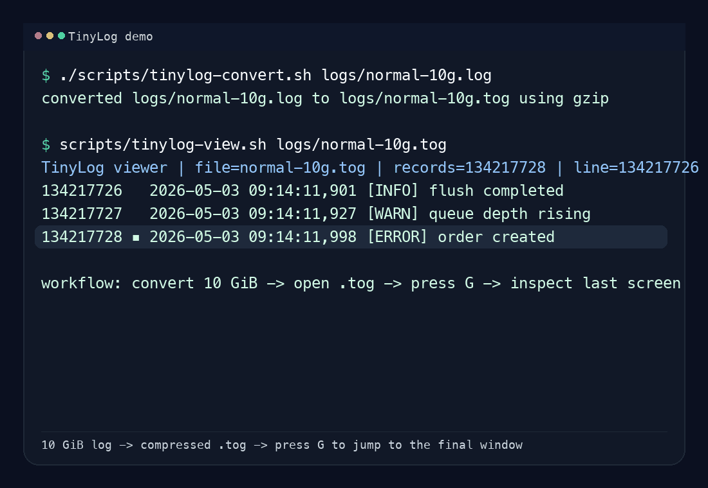

# TinyLog

<p align="center">
  
</p>

<p align="center">
  
</p>

[Chinese README](README.zh-CN.md)

`TinyLog` is a project scaffold for **high-density log storage** and **low-memory log access**.
It targets the two main pain points of traditional plaintext logging: excessive storage cost and expensive traversal of very large files.

## Vision

Traditional logs are usually stored as plaintext. That creates two systemic issues:

1. **Storage overhead**: plaintext logs contain high redundancy and grow quickly over time.
2. **Read amplification**: once files become large, scanning, browsing, filtering, and locating entries can consume too much memory.

The project is initialized around two product surfaces:

1. **Java SDK** for application integration, with business-facing logging APIs similar in role to `slf4j`.
2. **Rust tools** for converting plaintext logs into proprietary TinyLog files and browsing them with a `vim`-like workflow for searching and positioning.

## Modules

| Module | Responsibility |
| --- | --- |
| `tinylog-core` | Core log domain model, codec abstractions, and reader/writer contracts |
| `tinylog-sdk` | Business-facing Java logging API, logger factories, direct `.tog` file backend, and SLF4J 2.0.17 bridge support |
| `tinylog-rust-common` | Shared Rust TinyLog format and protobuf support |
| `tinylog-converter` | Rust CLI for converting plaintext logs into `.tog` files |
| `tinylog-viewer` | Rust CLI for interactive TinyLog browsing |

## Collaboration Guidelines

Repository collaboration rules, engineering conventions, and commit conventions live in [`AGENTS.md`](AGENTS.md).

## Current Technical Direction

- **Java namespace**: `com.huimang.tinylog`
- **Java build**: Maven multi-module project for `tinylog-core` and `tinylog-sdk`
- **Java SDK compatibility**: `slf4j-api:2.0.17` with verified `slf4j-simple:2.0.17` integration plus a direct `.tog` file logger factory
- **Rust workspace**: split into `tinylog-rust-common`, `tinylog-converter`, and `tinylog-viewer`
- **Shared contract**: protobuf schema in `tinylog-core/src/main/proto/tinylog/prototype.proto`
- **Java protobuf generation notes**: `docs/protobuf-java-generation.md`
- **Storage structure docs (EN)**: `docs/log-storage-structure.md`
- **Storage structure docs (ZH-CN)**: `docs/zh-CN/log-storage-structure.md`

## Prototype File Format

The current prototype uses a **trunk-based** `.tog` binary layout with whole-trunk compression, lightweight indexing, and low-memory windowed reads for interactive browsing.

The full storage structure, field definitions, and design rationale live in:

- English: [`docs/log-storage-structure.md`](docs/log-storage-structure.md)
- Chinese: [`docs/zh-CN/log-storage-structure.md`](docs/zh-CN/log-storage-structure.md)

## Manual Prototype Testing

The current prototype accepts plaintext log lines in this format:

```text
<yyyy-MM-dd HH:mm:ss,SSS> [LEVEL] <message>
```

The converter interprets that timestamp text as a **UTC calendar value**, extracts the first `[LEVEL]` token into a dedicated one-byte field, removes that token from the stored message body, and the viewer reconstructs the line using the persisted level plus the UTC timestamp offset. Inputs up to **100 MiB** use serial conversion to avoid scheduling overhead; larger inputs switch to a master/worker pipeline where the master plans trunk boundaries, workers compress contiguous trunk batches in parallel, and the master merges the worker outputs in order while reporting per-worker progress.

### 1. Create a sample `normal.log`

```bash
cat > normal.log <<'EOF'
2026-05-01 22:01:00,253 [INFO] service started
2026-05-01 22:01:00,278 [WARN] user signed in
2026-05-01 22:01:00,353 [ERROR] order created
EOF
```

### 2. Convert `normal.log` to `normal.tog`

```bash
cargo run --quiet --manifest-path tinylog-converter/Cargo.toml -- normal.log normal.tog
```

Helper script:

```bash
scripts/tinylog-convert.sh normal.log
```

Reverse conversion is also available:

```bash
scripts/tinylog-convert.sh --reverse normal.tog
```

Expected output:

```text
using serial conversion mode for inputs up to 100.00 MiB
progress: 0/120 (0.00%)
progress: 120/120 (100.00%)
converted normal.log to normal.tog using gzip
source size: 120 (120 B)
output size: 111 (111 B)
compression ratio: 92.50%
elapsed: 4ms
```

For large inputs above `100 MiB`, the converter starts indexing immediately by byte range and prints one live horizontal worker line based on **completed trunks / assigned trunks**, for example:

```text
building trunk index and preparing worker assignments for huge.log
indexing: 0/10737418317 (0.00%)
indexing: 10737418317/10737418317 (100.00%)
compressing 157 trunks with 16 workers
writing: 1: 0% 2: 0% 3: 0% 4: 0%
writing: 1: 10% 2: 20% 3: 24% 4: 10%
```

### 3. Read `normal.tog` with the Rust viewer

```bash
cargo run --quiet --manifest-path tinylog-viewer/Cargo.toml -- normal.tog
```

Helper scripts:

```bash
scripts/tinylog-view.sh normal.tog
scripts/tinylog-open.sh normal.log
```

## Java Example Project

`tinylog-example` now includes:

- `TinylogSdkYamlExample`: console + `.tog` output demo
- `TinylogLargeTogExample`: generates a large `.tog` fixture, defaulting to roughly `120 MiB`

Example command:

```bash
java -cp "tinylog-example/target/classes:tinylog-sdk/target/classes:tinylog-core/target/classes:$HOME/.m2/repository/org/yaml/snakeyaml/2.2/snakeyaml-2.2.jar" \
  com.huimang.tinylog.example.TinylogLargeTogExample
```

Key bindings:

```text
j / DownArrow   move down
k / UpArrow     move up
Enter           move down by 1/4 page
d / PageDown    page down
u / PageUp      page up
g               jump to top
G               jump to bottom
:N              jump to line N
/keyword        search keyword by trunk and jump to the nearest result
:debug          filter one level (also :trace/:info/:warn/:error)
:help           open the help popup
n               move to next cached search result / continue trunk scan
p               move to previous cached search result / continue trunk scan
Esc             clear filter/search or close help
q               quit
```

Expected screen content:

```text
TinyLog viewer | file=normal.tog | records=3 | line=1 | j/k move  enter +1/4  d/u page  g/G ends  q quit
     1 ▪2026-05-01 22:01:00,253 [INFO] service started
     2  2026-05-01 22:01:00,278 [WARN] user signed in
     3  2026-05-01 22:01:00,353 [ERROR] order created
```

The viewer stays open like a lightweight vim-style browser. The display area is rendered as two independent panes: a blue left logical line-number pane and a right content pane, with a pale-orange rectangular marker offset slightly to the right of the line numbers for the focused row. The marker is shown only on the first physical row of the focused logical log entry. One logical log line can span multiple rendered rows because of width limits or embedded newlines, but it still keeps a single sequence number in the left pane. The focused line moves freely inside the viewport and the screen scrolls only when another move would push that focused row past the top or bottom edge.

### 4. Re-run the automated converter test only

```bash
cargo test -p tinylog-converter convert_plaintext_log_writes_parseable_tog
```

## Near-Term Roadmap

1. Define the TinyLog file header, block layout, and index structure
2. Implement streaming writer/reader paths and compression codecs
3. Add a default Java SDK implementation behind the abstract logging API
4. Add paging, search, and jump workflows to the Rust viewer

## License

This project is licensed under the [MIT License](LICENSE).
